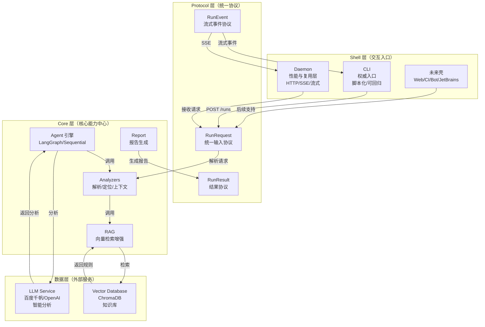

# Stability Analysis Agent 架构图

本文档展示系统架构设计。

## 整体架构图



## 分层说明

### Shell 层
- **CLI**：权威入口，脚本化回归测试
- **Daemon**：HTTP 服务，支持流式输出、任务复用
- **未来壳**：Web/CI/Bot/JetBrains 等

### Protocol 层
- **RunRequest**：统一输入协议
- **RunEvent**：流式事件协议（SSE）
- **RunResult**：结果协议

### Core 层
- **Agent 引擎**：LangGraph/Sequential 工作流
- **Analyzers**：解析器、地址解析、代码上下文
- **RAG**：向量检索增强
- **Report**：报告生成

### 数据层
- **Vector Database**：ChromaDB 知识库
- **LLM Service**：OpenAI/DeepSeek/百度千帆等

## 数据流

```
用户请求 (CLI/Daemon)
    │
    ▼
RunRequest (Protocol)
    │
    ▼
Core 分析流程
    │
    ├─→ crash_log_parser
    ├─→ add2line_resolver
    ├─→ code_content_provider
    ├─→ RAG 检索
    └─→ LLM 分析
    │
    ▼
RunResult / RunEvent
    │
    ▼
返回结果
```

## 与闭源工作区关系

开源项目与闭源工作区（`map_sdk_crash_agent/`）共享 Core 层和工具链，闭源工作区可以在此基础上添加：
- 私有崩溃案例
- 自定义配置
- 私有 UI 层（如有）
